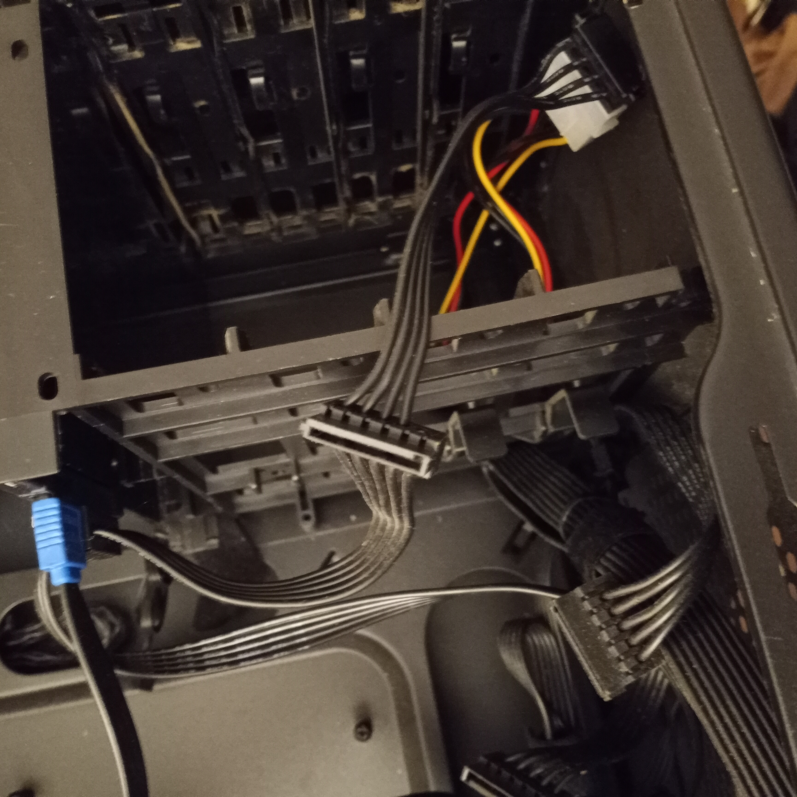
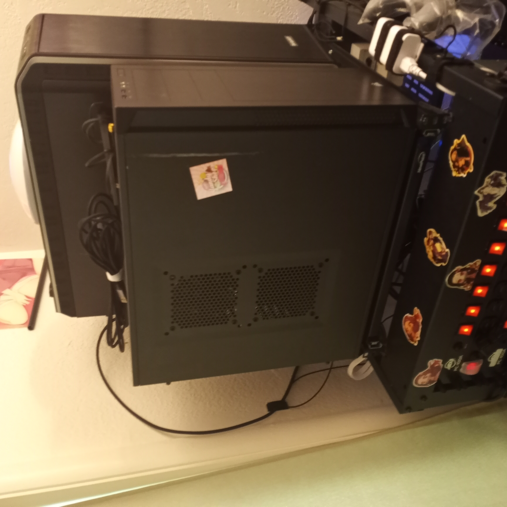
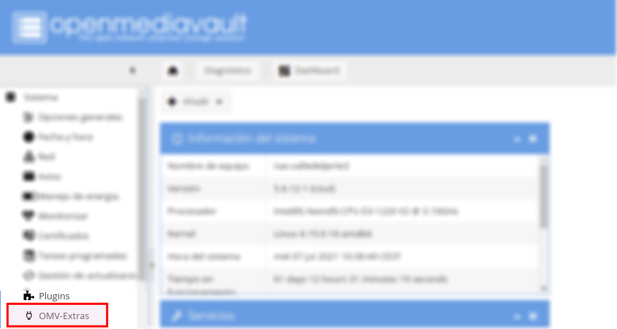
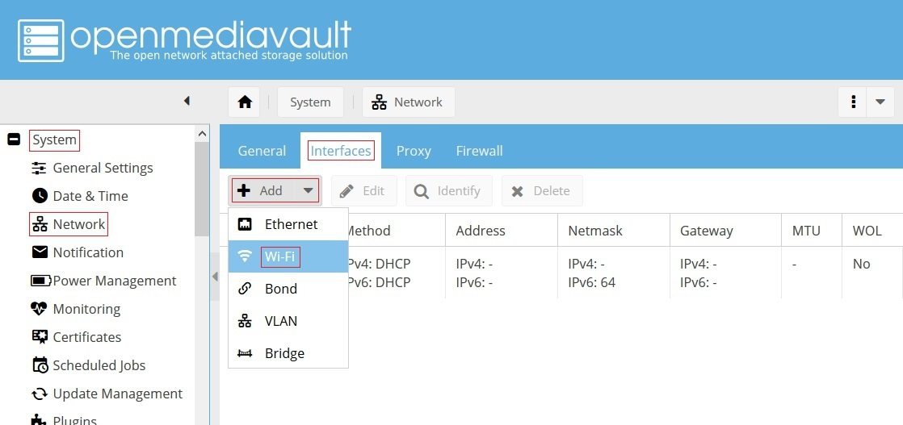
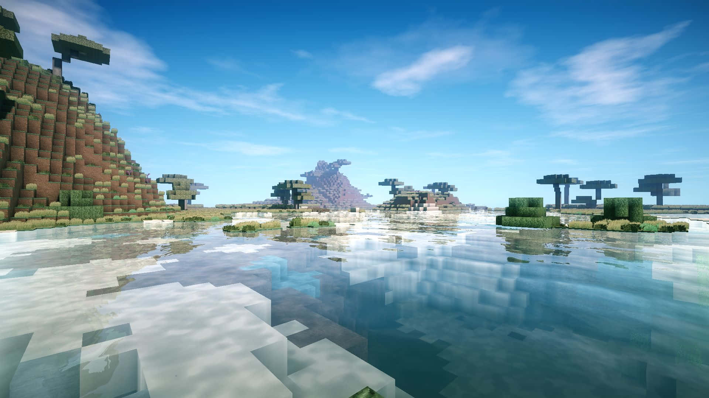

# my home lab setup.
my first lab setup
A Humble start

## The Paper Weight:
I purchased a secondary PC with the intention of hosting games for myself and a friend, allowing my main computer to remain offline. At the time, I was unemployed and unsure of what I truly needed. My budget was limited to around $100, which led me to acquire a $86 system featuring an AMD A8-5500 dual-core processor, 16 GB of RAM (likely DDR2 or DDR3—it's been a while), and a single hard drive.

I began by installing OpenMediaVault (OMV) version 5.5 and used it to host Docker containers for games such as Don't Starve, Minecraft, and a few others. I also ran both Jellyfin and Plex simultaneously, providing just enough media streaming capability for two devices—a tablet and a PC.

Unfortunately, the second drive (a 2.5" 1TB HDD) failed. I replaced it with a 250 GB SSD dedicated to Docker containers, which significantly improved speed and responsiveness. This setup served me well for approximately two years. Now all docker was on the ssd main system would just boot and share and I had a large spinner drive for movies.

The network was a simple flat /24 configuration consisting of a single router and two Cat 8 Ethernet cables. While most devices connected wirelessly, both the server and the primary gaming rig were typically connected via LAN for stability and performance.

After some experimentation, I had the foresight to implement NGINX Proxy Manager along with a few redirect rules. I also configured the system to only open game-related ports when they were actively in use, enhancing both security and efficiency.

Because my public IP address was semi-static—essentially DHCP that changed unpredictably—I set up dynamic DNS using DuckDNS. This was managed through a second Docker container.

The following outlines the setup: where it was hosted, how it was configured, and what services were running. While the system was capable of supporting 80–100 users, in practice it typically served between 2 and 6.

This was the very first server I hosted.   

## Installation start:
omv 5.0 iso
After a sit and basic installation, we then move to: OMV Extras.   In this version, this is what opens up Yacht, Portainer,  Docker, and some other nice things.

sudo apt-get install docker.io:  Normally, I would do this, but back in 5.x, you had to use xtras. So, as needed, I did Docker from that, then did Portainer the same way, as it was built into the dashboard back then. 

## What Does What?
This was my first home movie setup, so I went with Jellyfin, Plex, and I had a Raspberry Pi 2 at the time that did nothing but pull and push names (.info files). It would read the fact that something got added in the last 1-3 hrs, pull the .info to the pi, then push the info up to the server. * I did this to save power, time, and cycles*  At the time, this served a 10-person family as well as did games with zero problem.

What games, what, why, and how. I spoke to my friend, and at the time we decided to just do a vanilla Minecraft with no protections and don't-starve-together. This allowed us to leave it running or let someone play, even if I couldn't be home to host. We also did the early version of satisfactory (twice)

## Games:
(note this is over 4 years old and i would not suggest it today) 
dont starve:
https://hub.docker.com/r/jmarques15/dont-starve-together

## Don't Starve:
Dont-Starve-Together-Server:

This is a simple Dont Starve Together server I created to learn and consolidate some docker concepts related to the building of images and running multi-container solutions.
The entrypoint.sh script takes care of reading environment variables for easier configuration of the server at startup without the need to fiddle with files directly. To safeguard against restarts, a named volume is created at startup that mounts in both containers to hold server configuration and save information.

Create Server Token
Browse to the website: https://accounts.klei.com/account/game/servers?game=DontStarveTogether⁠
Add a cluster name and click 'Add new server' and finally copy the token.
Starting the server
Configure environment variables as necessary.
Simple single shard (no caves)

docker run -d --name dst_master \
-e DST_NAME="<name>" \
-e DST_DESCRIPTION="<description>" \
-e DST_PASSWORD="<password>" \
-e DST_MODE="<survival|Wilderness|Endless>" \
-e DST_INTENTION="<Social|Cooperative|Competitive|Madness>" \
-e DST_MAX_PLAYERS="6" \
-e DST_PVP="<true|false>" \
-e DST_TOKEN="<token>" \
-v dst-cluster-config:/home/LinuxGSM/.klei/DoNotStarveTogether/Cluster_1/ \
jmarques15/dont-starve-together
Multi-shard (with caves)
docker network create dst_network

docker run -d --network dst_network -name dst_master \
-e DST_NAME="<name>" \
-e DST_DESCRIPTION="<description>" \
-e DST_PASSWORD="<password>" \
-e DST_MODE="<survival|Wilderness|Endless>" \
-e DST_INTENTION="<Social|Cooperative|Competitive|Madness>" \
-e DST_MAX_PLAYERS="6" \
-e DST_PVP="<true|false>" \
-e DST_TOKEN="<token>" \
-e DST_SHARD=Master \
-v dst-cluster-config:/home/LinuxGSM/.klei/DoNotStarveTogether/Cluster_1/ \
jmarques15/dont-starve-together

docker run -d --network dst_network -name dst_caves \
-e DST_NAME="<name>" \
-e DST_DESCRIPTION="<description>" \
-e DST_PASSWORD="<password>" \
-e DST_MODE="<survival|Wilderness|Endless>" \
-e DST_INTENTION="<Social|Cooperative|Competitive|Madness>" \
-e DST_MAX_PLAYERS="6" \
-e DST_PVP="<true|false>" \
-e DST_TOKEN="<token>" \
-e DST_SHARD=Caves \
-v dst-cluster-config:/home/LinuxGSM/.klei/DoNotStarveTogether/Cluster_1/ \
jmarques15/dont-starve-together

---------
Note that, as we did with a few playthoughts, we decided to add mods and some custom characters. This was not as easy as it sounds, but I ended up pulling that off as well. 

## Mine Craft:
https://hub.docker.com/r/rlenferink/minecraft

How to:

A nice and easy way to get a Minecraft server up and running using docker. For help on getting started with docker see the official getting started guide⁠. For more information on Minecraft and check out it's website⁠

Note: that Minecraft can only have protections if the Docker itself protects them. To prevent this, I simply password-protected the actual server so that unauthorized individuals cannot gain access.

Quickstart

To quickly get your container up and running execute on of the following commands

To run minecraft without volume mount, run:

docker run -d --name=mc -p 25565:25565 rlenferink/minecraft /start

To run minecraft with volume mount, run:

docker run -d --name=mc -p 25565:25565 -v /mnt/minecraft:/data rlenferink/minecraft /start

Running minecraft with volume mount is to save your world data.
Running docker-minecraft

Running the first time will set your port to a static port of your choice so that you can easily map a proxy to. If this is the only thing running on your system you can map the port to 25565 and no proxy is needed. i.e. -p 25565:25565 . If you want to enable the query protocol you need to add another -p 25565:25565/udp to forward the UDP protocol on the same port as well. Also be sure your mounted directory on your host machine is already created before running mkdir -p /mnt/minecraft.

docker run -d --name=mc -p 25565:25565 -v /mnt/minecraft:/data rlenferink/minecraft /start

From now on when you start/stop docker-minecraft you should use the container id with the following commands. To get your container id, after you initial run type sudo docker ps and it will show up on the left side followed by the image name which is rlenferink/minecraft:latest.

docker start <container_id>
docker stop <container_id>

Building docker-minecraft

Running this will build you a docker image with the latest version of both docker-minecraft and Minecraft itself.

git clone https://github.com/rlenferink/docker-minecraft
cd docker-minecraft
docker build -t rlenferink/minecraft .

Notes on the run command

    -d allows this to run cleanly as a daemon, remove for debugging
    -p is the port it connects to, -p host_port:docker_port
    -v is the volume you are mounting -v host_dir:docker_dir
    rlenferink/minecraft is how this docker image is called

---------
## Satisfactory 
note: this was not the same from a while back its not working so im posting this incase somebody would like to copy this on a low end system:

https://github.com/delath/containers-hub/tree/main/satisfactory

services:
  satisfactory:
    image: delath/satisfactory
    container_name: satisfactory
    ports:
      - '7777:7777/tcp'
      - '7777:7777/udp'
    volumes:
      - './Server:/config'
    restart: 'unless-stopped'
    environment:
      - MAXPLAYERS=4

---------
## Locking it all down:
(if new use this >)
https://hub.docker.com/r/zoeyvid/nginx-proxy-manager/tags

older setup>

sudo apt install apt-transport-https ca-certificates curl software-properties-common -y
curl -fsSL https://download.docker.com/linux/ubuntu/gpg | sudo gpg --dearmor -o /usr/share/keyrings/docker-archive-keyring.gpg
echo "deb [arch=$(dpkg --print-architecture) signed-by=/usr/share/keyrings/docker-archive-keyring.gpg] https://download.docker.com/linux/ubuntu $(lsb_release -cs) stable" | sudo tee /etc/apt/sources.list.d/docker.list > /dev/null
sudo apt update
sudo apt install docker-ce docker-ce-cli containerd.io -y

sudo systemctl status docker

sudo curl -L "https://github.com/docker/compose/releases/latest/download/docker-compose-$(uname -s)-$(uname -m)" -o /usr/local/bin/docker-compose
sudo chmod +x /usr/local/bin/docker-compose
docker-compose --version

mkdir ~/nginx-proxy-manager && cd ~/nginx-proxy-manager
nano docker-compose.yml

version: '3'
services:
 app:
   image: 'jc21/nginx-proxy-manager:latest'
   restart: unless-stopped
   ports:
     - '80:80'
     - '81:81'
     - '443:443'
   volumes:
     - ./data:/data
     - ./letsencrypt:/etc/letsencrypt
   environment:
     DB_MYSQL_HOST: "db"
     DB_MYSQL_PORT: 3306
     DB_MYSQL_USER: "npm"
     DB_MYSQL_PASSWORD: "npm"
     DB_MYSQL_NAME: "npm"
 db:
   image: 'jc21/mariadb-aria:latest'
   restart: unless-stopped
   environment:
     MYSQL_ROOT_PASSWORD: 'npm'
     MYSQL_DATABASE: 'npm'
     MYSQL_USER: 'npm'
     MYSQL_PASSWORD: 'npm'
   volumes:
     - ./data/mysql:/var/lib/mysql

sudo docker-compose up -d
sudo docker-compose ps

In addition I also added:

Install Fail2ban
    Working only with SSH keys
    Reduce Idle timeout interval
    Disable passwords
    Disable x11 forwarding
    Use a different port
    Limit users' SSH access
    Disable root logins
    Use SSH proto 2
    Enable 2FA Authentication for SSH
    Wire Guard for external access

---------

## Adding in things proves to be a bad idea:
I decided to add Nextcloud, or Owncloud, for easy file sharing. This allows me to give people files as I wish, using a simple Duck DNS address with Nginx as the backend. At this time, I do not own a DNS or domain, so I chose to go with DuckDNS as it's free and I have no income. 
    
This, however, proves to be not the best idea for some reason. The "Cloud" seems to randomly kill the server, breaking Docker completely, which results in needing a full format and reinstall of the main drive. 
I could never figure out why this was happening, but I was getting sick of it, so I quit using anything that wasn't Jellyfin Plex. One of the games (at a time) would be active, which saved overall memory and CPU, as they were prime real estate.

