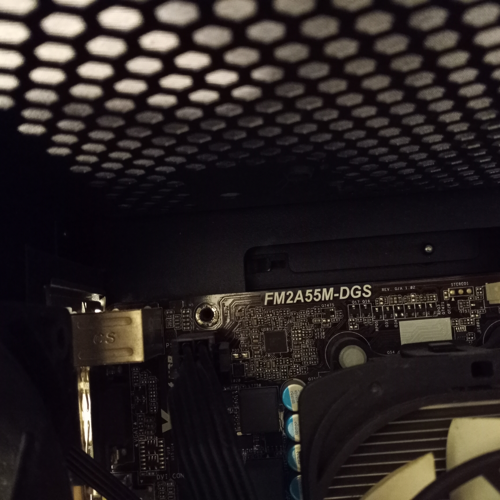

# my home lab setup.
my first lab setup
A Humble start

## The Paper Weight:
I purchased a secondary PC with the intention of hosting games for myself and a friend, allowing my main computer to remain offline. At the time, I was unemployed and unsure of what I truly needed. My budget was limited to around $100, which led me to acquire a $86 system featuring an AMD A8-5500 dual-core processor, 16 GB of RAM (likely DDR2 or DDR3—it's been a while), and a single hard drive.

I began by installing OpenMediaVault (OMV) version 5.5 and used it to host Docker containers for games such as Don't Starve, Minecraft, and a few others. I also ran both Jellyfin and Plex simultaneously, providing just enough media streaming capability for two devices—a tablet and a PC.

Unfortunately, the second drive (a 2.5" 1TB HDD) failed. I replaced it with a 250 GB SSD dedicated to Docker containers, which significantly improved speed and responsiveness. This setup served me well for approximately two years. Now all docker was on the ssd main system would just boot and share and I had a large spinner drive for movies.

The network was a simple flat /24 configuration consisting of a single router and two Cat 8 Ethernet cables. While most devices connected wirelessly, both the server and the primary gaming rig were typically connected via LAN for stability and performance.

After some experimentation, I had the foresight to implement NGINX Proxy Manager along with a few redirect rules. I also configured the system to only open game-related ports when they were actively in use, enhancing both security and efficiency.

Because my public IP address was semi-static—essentially DHCP that changed unpredictably—I set up dynamic DNS using DuckDNS. This was managed through a second Docker container.

The following outlines the setup: where it was hosted, how it was configured, and what services were running. While the system was capable of supporting 80–100 users, in practice it typically served between 2 and 6.

This was the very first server I hosted.   

